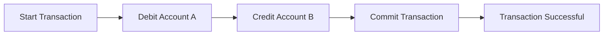
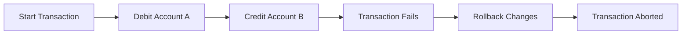

# Atomicity
### as you know what is transaction; its looked as a unit of logic
- the transaction have some query in it.
- the queries can be related to each other or not
- regardless, all of the query have one logically goal that the programmer defined it base on the business logic of project

#### so what do you think about what should happen if one single query failed in like 20 queries?
- life goes on and nothing happend???
- rollback entire transaction???
#### well base on  what you learn, if the chain of query of the transaction failed, well the whole transaction unit is failed.
think about it what is the point if queries of the transaction which supposed to be a unit failed and still transaction commit and continue?
#### Its should be like 0 or 1, or all the queries gonna succeed or NOTHING gonna execute (nor effect) among the queries  of that transaction. just like atom i think so.

##  Atomicity Visualization

## Transaction Example

### Initial State
- **Account A**: $100
- **Account B**: $50

### Transaction: Transfer $30 from Account A to Account B

### Final State (if transaction is successful)
- **Account A**: $70
- **Account B**: $80

### Transaction Failure
If the transaction fails at any point, it should roll back to the initial state:

## Transaction Flow

### Successful Transaction

### Failed Transaction

