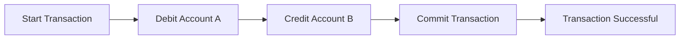

# Atomicity
### as you know transaction is looked at as a unit of logic

- the transaction has some queries in it.
- the queries can be related to each other or not.
- regardless, all of the queries (in transaction) have one logical goal which is the  (programmer-defined) based on the business logic of the project.

#### so what do you think about what should happen if one single query failed in like 20 queries?
- life goes on and nothing happened ???
- rollback entire transaction???
#### well based on  what you learn, if the chain of the query of the transaction failed, well the whole transaction unit failed.
think about it, what is the point if queries of the transaction which are supposed to be a unit, fail and still committed and continue?
#### It should be like 0 or 1, or all the queries gonna succeed or NOTHING gonna execute (nor effect) among the queries of that transaction. just like the atom.
#### so what do you think about what should happen if one single query failed in like 20 queries or some failure happend in middle of transaction?
- life goes on and nothing happend???
- rollback entire transaction???
#### well base on  what you learn, if the chain of query of the transaction failed, well the whole transaction unit is failed.
think about it what is the point if queries of the transaction which supposed to be a unit failed and still he successful parts of transaction commit and continue **this cause inconsistency !!!**?
#### Its should be like 0 or 1, or all the queries gonna succeed or NOTHING gonna execute (nor effect) among the queries  of that transaction. just like atom i think so.

##  Atomicity Visualization

## Transaction Example

### Initial State
- **Account A**: $100
- **Account B**: $50

### Transaction: Transfer $30 from Account A to Account B

### Final State (if transaction is successful)
- **Account A**: $70
- **Account B**: $80

### Transaction Failure
If the transaction fails at any point, it should roll back to the initial state:

## Transaction Flow

### Successful Transaction

### Failed Transaction
```mermaid
graph LR
  A[Start Transaction] --> B[Debit Account A]
  B --> C[Credit Account B]
  C --> D[Transaction Fails]
  D --> E[Rollback Changes]
  E --> F[Transaction Aborted]

